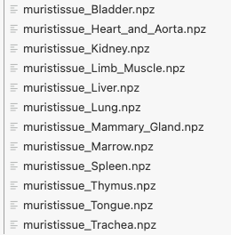
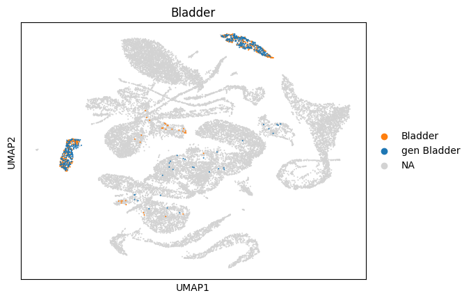
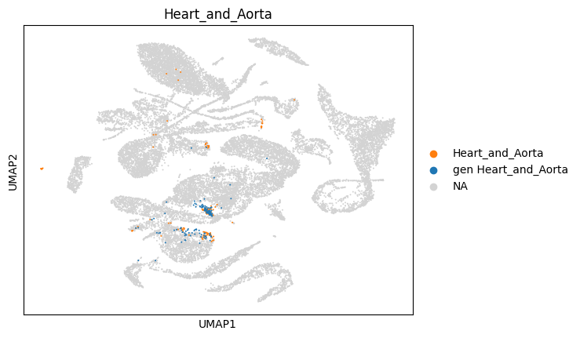
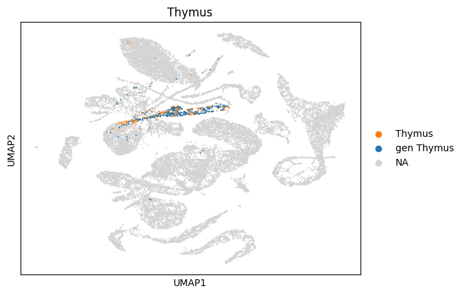

# How to run scDiffusion on Tabula Muris dataset

First we are going to see how we can simulate similar data to the input one. In this first step the goal is to augment already existing data. We are asking the model to create samples that are similar to the input one. The muris dataset contains data that correspond to several tissues. We are going to ask the model to produce, for each of these tissues, a sample of similar type. Generating data in this way is called *unconditional data sampling.* 

# Data

- Download the muris dataset (muris.zip) from: [https://figshare.com/s/49b29cb24b27ec8b6d72](https://figshare.com/s/49b29cb24b27ec8b6d72).
- Download the SCimilarity weights (annotation_model_v1.tar.gz) from: [https://zenodo.org/records/8286452](https://zenodo.org/records/8286452)

# **Training the models: train the VAE, the diffusion model and the classifier**

Given the tabula muris dataset is downloaded under a path, e.g. `'/workspace/projects/001_scDiffusion/data/data_in/tabula_muris/all.h5ad'`, please follow the steps below to be able to reproduce the unconditional and conditional results from the paper  [scDiffusion paper](https://arxiv.org/abs/2401.03968).

## Train the VAE

**You have:**

- The unzipped muris adata file saved at e.g. (see Data for download: [https://figshare.com/s/49b29cb24b27ec8b6d72](https://figshare.com/s/49b29cb24b27ec8b6d72))

```jsx
'/workspace/projects/001_scDiffusion/data/data_in/tabula_muris/all.h5ad'
```

- The SCimilarity pretrained weights saved and unzipped at e.g. (see Data for download: [https://zenodo.org/records/8286452](https://zenodo.org/records/8286452))

```jsx
'/workspace/projects/001_scDiffusion/scripts/scDiffusion/annotation_model_v1'
```

**You need to do:**

- Prior to training, create the folder `path/to/saved_VAE_model`.
- In the terminal, navigate to the `VAE` directory:
    
    ```bash
    cd VAE
    ```
    
- Run the following command to train the Autoencoder (you have *cd*ed in the folder where VAE_train.py is located):
    
    ```bash
    echo "Training Autoencoder, this might take a long time"
    CUDA_VISIBLE_DEVICES=0 python VAE_train.py --data_dir '/workspace/projects/001_scDiffusion/data/data_in/tabula_muris/all.h5ad' --num_genes 18996 --state_dict "/workspace/projects/001_scDiffusion/scripts/scDiffusion/annotation_model_v1" --save_dir '../checkpoint/AE/my_VAE' --max_steps 200000 --max_minutes 600
    echo "Training Autoencoder done"
    ```
- In general, the above amounts to:
    ```bash
    echo "Training Autoencoder, this might take a long time"
    CUDA_VISIBLE_DEVICES=0 python /path/to/VAE_train.py --data_dir '/path/where/you/saved/tabula_muris/all.h5ad' --num_genes 18996 --state_dict "/path/where/you/saved/scimilarity/pretrained/wrights/annotation_model_v1" --save_dir '/dir/where/to/save/the/trained/VAE/model/' --max_steps 200000 --max_minutes 600
    echo "Training Autoencoder done"
    ```
    
- (Further info — no need to run that) Several arguments can be passed, which are explained in VAE_train.py
    
    ```python
    def parse_arguments():
        """
        Read arguments if this script is called from a terminal.
        """
    
        parser = argparse.ArgumentParser(description="Finetune Scimilarity")
        # dataset arguments
        parser.add_argument("--data_dir", type=str, default='/data1/lep/Workspace/guided-diffusion/data/tabula_muris/all.h5ad')
        parser.add_argument("--loss_ae", type=str, default="mse")
        parser.add_argument("--decoder_activation", type=str, default="ReLU")
    
        # AE arguments                                             
        parser.add_argument("--local_rank", type=int, default=0)  
        parser.add_argument("--split_seed", type=int, default=1234)
        parser.add_argument("--num_genes", type=int, default=18996)
        parser.add_argument("--seed", type=int, default=0)
        parser.add_argument("--hparams", type=str, default="")
    
        # training arguments
        parser.add_argument("--max_steps", type=int, default=200000)
        parser.add_argument("--max_minutes", type=int, default=3000)
        parser.add_argument("--checkpoint_freq", type=int, default=50000)
        parser.add_argument("--batch_size", type=int, default=128)
        parser.add_argument("--state_dict", type=str, default="/data1/lep/Workspace/guided-diffusion/scimilarity-main/models/annotation_model_v1")  # if pretrain
        # parser.add_argument("--state_dict", type=str, default=None)   # if not pretrain
    
        parser.add_argument("--save_dir", type=str, default='../output/ae_checkpoint/muris_AE')
        parser.add_argument("--sweep_seeds", type=int, default=200)
        return dict(vars(parser.parse_args()))
    ```
    

## Train the diffusion model

**You have:**

- The unzipped muris adata file saved at e.g. (see Data for download: [https://figshare.com/s/49b29cb24b27ec8b6d72](https://figshare.com/s/49b29cb24b27ec8b6d72))
    
    ```jsx
    '/workspace/projects/001_scDiffusion/data/data_in/tabula_muris/all.h5ad'
    ```
    
- The trained VAE model
    
    ```jsx
    '/workspace/projects/001_scDiffusion/scripts/scDiffusion/checkpoint/AE/my_VAE/model_seed=0_step=40753.pt'
    ```
    
- You have created a folder to save the diffusion model:
    
    ```jsx
    '/workspace/projects/001_scDiffusion/scripts/output/diffusion_checkpoint'
    ```
    

**You need to do:**
You have *cd*ed in the folder where cell_train.py is located.

```jsx
echo "Training diffusion backbone"
CUDA_VISIBLE_DEVICES=0 python cell_train.py --data_dir '/workspace/projects/001_scDiffusion/data/data_in/tabula_muris/all.h5ad'  --vae_path '/workspace/projects/001_scDiffusion/scripts/scDiffusion/checkpoint/AE/my_VAE/model_seed=0_step=40753.pt'  \
    --save_dir '/workspace/projects/001_scDiffusion/scripts/output/diffusion_checkpoint' --model_name 'my_diffusion' --lr_anneal_steps 80000
echo "Training diffusion backbone done"
```

In general, the above amounts to do:
```bash
echo "Training diffusion backbone"
CUDA_VISIBLE_DEVICES=0 python path/to/cell_train.py --data_dir '/path/where/you/saved/tabula_muris/all.h5ad' --vae_path '/path/where/you/saved/VAE/model.pt'   \
    --save_dir '/dir/where/to/save/the/trained/diffusion/model/' --model_name 'name_you_want_to_give' --lr_anneal_steps 80000
echo "Training diffusion backbone done"
```

## Train the classifier

**You have:**

- The unzipped muris adata file saved at e.g. (see Data for download: [https://figshare.com/s/49b29cb24b27ec8b6d72](https://figshare.com/s/49b29cb24b27ec8b6d72))
    
    ```jsx
    '/workspace/projects/001_scDiffusion/data/data_in/tabula_muris/all.h5ad'
    ```
    
- The trained VAE model
    
    ```jsx
    '/workspace/projects/001_scDiffusion/scripts/scDiffusion/checkpoint/AE/my_VAE/model_seed=0_step=40753.pt'
    ```
    
- You have created a folder to save the classifier model:
    
    ```jsx
    "/workspace/projects/001_scDiffusion/scripts/output/classifier_checkpoint"
    ```
    

**You need to do:**

```jsx
echo "Training classifier"
CUDA_VISIBLE_DEVICES=0 python classifier_train.py --data_dir '/workspace/projects/001_scDiffusion/data/data_in/tabula_muris/all.h5ad' --model_path "/workspace/projects/001_scDiffusion/scripts/output/classifier_checkpoint" \
    --iterations 40000 --vae_path '/workspace/projects/001_scDiffusion/scripts/scDiffusion/checkpoint/AE/my_VAE/model_seed=0_step=40753.pt'
echo "Training classifier, done"
```

## Generate latent spaces: unconditional and conditional tabula muris

Once the models have been trained, we can create new samples. To this end, we first need to create the latent spaces that correspond to the simulated data. The last step will be to decode these latent spaces to retrieve the corresponding anndata. Several data can be created. We can create unconditional samples (these corresponds to data that should be as close as possible as the input data, essentially corresponding to data enhancement), and we can also create predictive data, for example we can try to create a set of adata that would make the interpolation between condition 1 and condition 2 in the dataset. 

1. **Unconditional data**
    1. **Terminal command** 
    
    ```jsx
    # Unconditional sampling
    python cell_sample.py --model_path "/workspace/projects/001_scDiffusion/scripts/output/diffusion_checkpoint/my_diffusion/model080000.pt" --sample_dir "/workspace/projects/001_scDiffusion/scripts/output/classifier_simulated"
    ```
    In general, the above amounts to do:
    ```bash
    python path/to/cell_sample.py --model_path "/path/where/you/saved/diffusion/model.pt" --sample_dir "/file/where/to/save/the/trained/latent/space/latent/space/example.npz"
    ```
    Note that though it is a file you have to give, the argument is called --sample_dir. 


2. **Conditional sampling**

    ***!! You have to modify classifier_sample.py***
    
    **Modify the main function of classifier_sample.py as follows**
    
    In order to be able to run multiple tissue types, one has to provide the information of where to store the simulated data in the main. 
    
    ```python
    if __name__ == "__main__":
        cato = ['Bladder', 'Heart_and_Aorta', 'Kidney', 'Limb_Muscle', 'Liver',
           'Lung', 'Mammary_Gland', 'Marrow', 'Spleen', 'Thymus', 'Tongue',
           'Trachea']
        
        parser = create_argparser()
        args = parser.parse_args()
        
        # Create a custom path for each tissue type
        save_dir = args.sample_dir
    
        for typ in range(12):
            print(f'----- tissue {cato[typ]} -----')
            path_to_save = save_dir + f'/tissue_{cato[typ]}'
            to_save = main(cell_type = [typ])
            save_data(to_save, typ, path_to_save)
    ```
    
    The result is 12 anndata outputs: 
    

    <div style="margin-top: 20px; margin-bottom: 20px; text-align: center;">
    
    </div>
    
    Where the modification has been to return what is saved in save_data from the main, and to allocate a specific path to it.  
    
## From latent space to anndata

1. **Unconditional**
Now that we have created the latent space we need to go back to data space. This is done by running the latent space in the VAE decoder. This is done by running the commands found in the jupyter notebook *unconditional_tabula_muris.ipynb*. The result thereof is as follows:

<div style="margin-top: 20px; margin-bottom: 20px; text-align: center;">
    
</div>

2. **Conditional** 
Follow the instructions in the jupyter notebook *conditional_tabula_muris.ipynb*. 
You get results that will look as follows.

<div style="margin-top: 20px; margin-bottom: 20px; text-align: center;">
    
</div>

<div style="margin-top: 20px; margin-bottom: 20px; text-align: center;">
    
</div>

<div style="margin-top: 20px; margin-bottom: 20px; text-align: center;">
    
</div>

<div style="margin-top: 20px; margin-bottom: 20px; text-align: center;">
    
</div>

<div style="margin-top: 20px; margin-bottom: 20px; text-align: center;">
    
</div>

<div style="margin-top: 20px; margin-bottom: 20px; text-align: center;">
    
</div>

<div style="margin-top: 20px; margin-bottom: 20px; text-align: center;">
    
</div>

<div style="margin-top: 20px; margin-bottom: 20px; text-align: center;">
    
</div>

<div style="margin-top: 20px; margin-bottom: 20px; text-align: center;">
    
</div>

<div style="margin-top: 20px; margin-bottom: 20px; text-align: center;">
    
</div>

<div style="margin-top: 20px; margin-bottom: 20px; text-align: center;">
    
</div>

<div style="margin-top: 20px; margin-bottom: 20px; text-align: center;">
    
</div>

# How to run scDiffusion: gradient interpolation on Waddington dataset

## Data

- Download the WOT dataset from: [https://figshare.com/s/49b29cb24b27ec8b6d72](https://figshare.com/s/49b29cb24b27ec8b6d72)

## Problem statement

Here we are interested in simulating data that is out of distribution. The typical usage would be for example if we have two conditions A and B, and we would like to simulate 10 data sets between these two points. The idea is to interpolate between two conditions. For this problem, we are going to use the Waddington dataset. In this dataset, single cell RNA-seq was performed at different time points, twice a day for several days. The full dataset looks like:

<div style="margin-top: 20px; margin-bottom: 20px; text-align: center;">
    
</div>

Here, we would like to predict time points between D2.5 and D5. We are therefore going to give as training set the following (the above minus D3, D3.5, D4, D4.5).

<div style="margin-top: 20px; margin-bottom: 20px; text-align: center;">
    
</div>

Hence, we would like to simulate data between the 5th data point (D2.5 comes in 5th position as we start counting from from 0) and the 6th data point (D5 is in 6th position in this modified dataset). 

To achieve this, we need to use the gradient interpolation function of scDiffusion. Again, we need to train the VAE, the diffusion model and the classifier. 

## Training

Note that on top of running the correct terminal commands, we need to modify the file training files, i.e. **VAE_train.py, cell_train.py** and **classifier_train.py** to allow to use the correct data loader that processes WOT. Note that it means that if one wants to use a new dataset, he needs to create a specific dataloader. I have not tackled the latter problem yet. 

### Training scimilarity (VAE)

```python
cd VAE
echo "Training Autoencoder, this might take a long time"
CUDA_VISIBLE_DEVICES=0 python VAE_train.py --data_dir '/workspace/projects/001_scDiffusion/data/data_in/data/WOT/train_WOT.h5ad' --num_genes 19423 --state_dict "/workspace/projects/001_scDiffusion/scripts/scDiffusion/annotation_model_v1" --save_dir '../checkpoint/AE/WOT_VAE' --max_steps 200000 --max_minutes 60
echo "Training Autoencoder done"
```

First, we need to do the following change on top of **VAE_train.py** to specify we are loading WOT data:

```python
# from guided_diffusion.cell_datasets import load_data
# from guided_diffusion.cell_datasets_sapiens import load_data
from guided_diffusion.cell_datasets_WOT import load_data
# from guided_diffusion.cell_datasets_muris import load_data
```

(note that when we were dealing with muris dataset it was muris).

### Training diffusion

```python
cd ..
echo "Training diffusion backbone"
CUDA_VISIBLE_DEVICES=0 python cell_train.py --data_dir '/workspace/projects/001_scDiffusion/data/data_in/data/WOT/train_WOT.h5ad'  --vae_path '/workspace/projects/001_scDiffusion/scripts/scDiffusion/checkpoint/AE/WOT_VAE/model_seed=0_step=163856.pt' \
    --save_dir '/workspace/projects/001_scDiffusion/scripts/output/WOT_diffusion' --model_name 'my_diffusion' --save_interval 20000
echo "Training diffusion backbone done"
```

Where on top of cell_train.py we need to uncomment/comment as follows:

```python
from guided_diffusion import dist_util, logger
# from guided_diffusion.cell_datasets import load_data
 from guided_diffusion.cell_datasets_WOT import load_data
# from guided_diffusion.cell_datasets_sapiens import load_data
# from guided_diffusion.cell_datasets_muris import load_data
from guided_diffusion.resample import create_named_schedule_sampler
```

### Training classifier

```python
echo "Training classifier"
CUDA_VISIBLE_DEVICES=0 python classifier_train.py --data_dir '/workspace/projects/001_scDiffusion/data/data_in/data/WOT/train_WOT.h5ad' --model_path "/workspace/projects/001_scDiffusion/scripts/output/WOT_classifier" \
    --iterations 100000 --vae_path '/workspace/projects/001_scDiffusion/scripts/scDiffusion/checkpoint/AE/WOT_VAE/model_seed=0_step=163856.pt'
echo "Training classifier, done"
```

Where on top of classifier_train.py we need to change following command:

```python
from guided_diffusion import dist_util, logger
from guided_diffusion.fp16_util import MixedPrecisionTrainer
# from guided_diffusion.cell_datasets_pbmc import load_data
from guided_diffusion.cell_datasets_WOT import load_data
# from guided_diffusion.cell_datasets_muris import load_data
# from guided_diffusion.cell_datasets_sapiens import load_data
```

And change the number of classes in:

```python
defaults.update(classifier_and_diffusion_defaults())
    defaults['num_class']= 15
    parser = argparse.ArgumentParser()
    add_dict_to_argparser(parser, defaults)
    return parser
```

### Creating latent spaces

Note that for scDiffusion, a few more arguments are needed, as can be found in classifier_sample.py:

```python
# In classifier_sample.py 
# if gradient interpolation
ae_dir='output/Autoencoder_checkpoint/WOT/model_seed=0_step=150000.pt', 
num_gene=19423, # WOT 19423
init_time = 600,    # initial noised state if interpolation
init_cell_path = 'data/WOT/filted_data.h5ad',   #input initial noised cell state

sample_dir=f"output/simulated_samples/muris",
start_guide_steps = 500,     # the time to use classifier guidance
filter = False,   # filter the simulated cells that are classified into other condition, might take long time
```

```python
# Conditional sampling 
python classifier_sample.py --model_path "/workspace/projects/001_scDiffusion/scripts/output/WOT_diffusion/my_diffusion/model200000.pt" --classifier_path "/workspace/projects/001_scDiffusion/scripts/output/WOT_classifier/model099999.pt" --sample_dir "/workspace/projects/001_scDiffusion/scripts/output/WOT_simulated" --ae_dir '/workspace/projects/001_scDiffusion/scripts/scDiffusion/checkpoint/AE/WOT_VAE/model_seed=0_step=163856.pt' --init_cell_path '/workspace/projects/001_scDiffusion/data/data_in/data/WOT/filted_data.h5ad' --num_gene 19423 
```

Where we need to change the number of classes to here 13 (17 - 4, i.e. 3, 3.5, 4 and 4.5):

```python
defaults.update(model_and_diffusion_defaults())
    defaults.update(classifier_and_diffusion_defaults())
    defaults['num_class']=13
    parser = argparse.ArgumentParser()
    add_dict_to_argparser(parser, defaults)
    return parser
```

We are going to simulate:

```python
if __name__ == 'main':
	parser = create_argparser()
  args = parser.parse_args()
  save_dir = args.sample_dir
  for i in range(0,11):
      path_to_save = save_dir + f"{i}"
      to_save = main(cell_type=[5,6], inter=True, weight=[10-i,i])
      save_data(to_save, i, path_to_save)
```

We are simulating 11 samples between the cell types 5 (2.5) and 6 (5) of the filtered anndata. 

Note the weight 

```jsx
weight=[10-i,i]
```

that supposedly allows to create step-wise data, that start by being more similar to data step 5 and ends up being more similar to data step 6. 

### Visualising results

Decoding the data necessitates to also change the num_genes to 19423 in:

```python
def load_VAE():
    autoencoder = VAE(
        num_genes=19423,
        device='cuda',
        seed=0,
        loss_ae='mse',
        hidden_dim=128,
        decoder_activation='ReLU',
    )
    autoencoder.load_state_dict(torch.load('/workspace/projects/001_scDiffusion/scripts/scDiffusion/checkpoint/AE/WOT_VAE/model_seed=0_step=163856.pt'))
    return autoencoder
```

The rest of the plotting can be found in script_diffusion_interpolation.ipynb (needs to be tweaked in function of the name given to the latent space embeddings). 

```jsx
# load generated cells with different Gradient Interpolations
stage_list = [str(i) for i in np.array(range(1,20))/2]
cell_gen = []
cell_stage = []
cell_dis = []

for i in range(11):
    npzfile=np.load(f'/data1/lep/Workspace/guided-diffusion/output/inter_wot_D3540/inter_{10-i}_{i}_scimilarity2.npz',allow_pickle=True)
    # npzfile=np.load(f'/data1/lep/Workspace/guided-diffusion/output/wot_condi/wot_{i}_scimilarity.npz',allow_pickle=True)
    length = 500
    cell_gen.append(npzfile['cell_gen'][:int(length)])#.squeeze(1)

    cell_stage+=[f'gen {i}']*int(length)
    cell_dis+=[float(i)]*int(length)

cell_gen = np.concatenate(cell_gen,axis=0)
total_gen = cell_gen.shape[0]

cell_combaine = np.concatenate((cell_gen,cell_w))

autoencoder = load_VAE()
cell_gen = autoencoder(torch.tensor(cell_combaine).cuda(),return_decoded=True).cpu().detach().numpy()[:total_gen]

cell_gen.shape
```

And I obtain:

<div style="margin-top: 20px; margin-bottom: 20px; text-align: center;">
    
</div>

Which yield nothing alike the original data:

<div style="margin-top: 20px; margin-bottom: 20px; text-align: center;">
    
</div>


Where sim is the simulated data and ori is the original dataset. Furthermore note that the simulated data all overlap, hence the step-wise interpolation did not work. 

<div style="margin-top: 20px; margin-bottom: 20px; text-align: center;">
    
</div>
